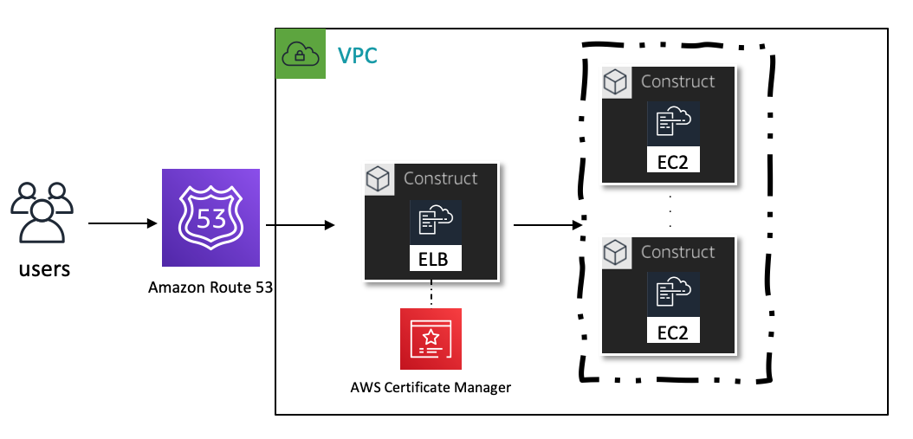
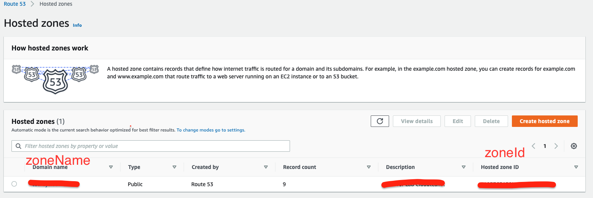
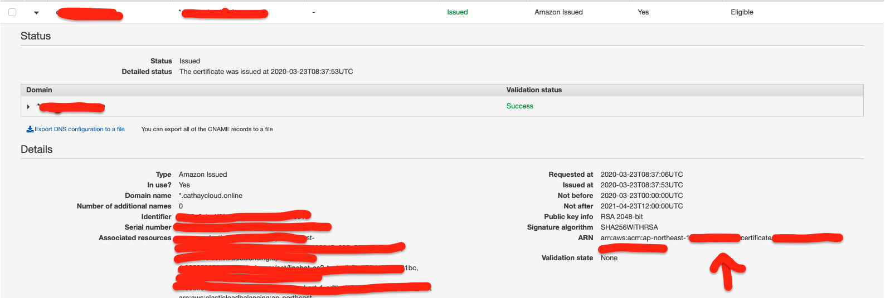

# ddt-techday-demo
DDT Tech Day Demo CDK Part.

## Create asg web server. 


## Need three value ?!
1. ROUTE53_HOST_ZONE_ID and ROUTE53_HOST_ZONE_NAME  like `example.com` and `ZXXXXXXXXXX` .

2. AMAZON_Certificates_Manager_ARN like
    `arn:aws:acm:region:account-id:certificate/xxxxxxx-oooo-oooo-oooo-xxxxxxxx` .


## How to use ?!
```bash
#export ENVVARS 
export ROUTE53_HOST_ZONE_ID=ZXXXXXXXXXX
export ROUTE53_HOST_ZONE_NAME=example.com
export AMAZON_Certificates_Manager_ARN=arn:aws:acm:region:account-id:certificate/xxxxxxx-oooo-oooo-oooo-xxxxxxxx

#To synth 
yarn synth -c zoneId=${ROUTE53_HOST_ZONE_ID} -c zoneName=${ROUTE53_HOST_ZONE_NAME} \
-c acm=${AMAZON_Certificates_Manager_ARN} 

#To Diff
yarn diff -c zoneId=${ROUTE53_HOST_ZONE_ID} -c zoneName=${ROUTE53_HOST_ZONE_NAME} \
-c acm=${AMAZON_Certificates_Manager_ARN} 

#To Deploy
yarn deploy --require-approval never -c zoneId=${ROUTE53_HOST_ZONE_ID} \
-c zoneName=${ROUTE53_HOST_ZONE_NAME} -c acm=${AMAZON_Certificates_Manager_ARN} 

#To Destroy
yarn destroy -f -c zoneId=${ROUTE53_HOST_ZONE_ID} -c zoneName=${ROUTE53_HOST_ZONE_NAME} \
-c acm=${AMAZON_Certificates_Manager_ARN} 
```